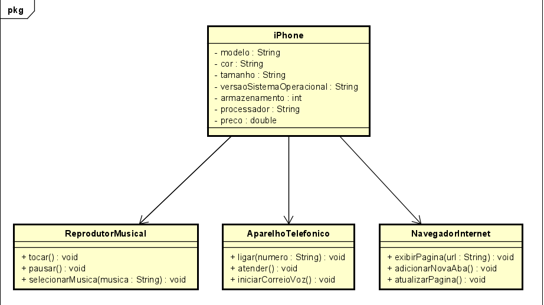

**Projeto iPhone em Java**

Este projeto consiste na implementação de um componente iPhone em Java, modelando suas funcionalidades principais, incluindo Aparelho Telefônico, Navegador na Internet e Reprodutor Musical. O objetivo é fornecer uma estrutura básica para simular as operações de um iPhone, como fazer chamadas, navegar na Internet e reproduzir música.

### Arquivos do Projeto:

1. **Iphone.java**: Classe principal que representa o iPhone e contém a funcionalidade principal do programa.

2. **AparelhoTelefonico.java**: Interface que define os métodos para as operações relacionadas ao Aparelho Telefônico, como fazer ligações e iniciar correio de voz.

3. **NavegadorInternet.java**: Interface que define os métodos para as operações relacionadas ao Navegador na Internet, como exibir páginas, adicionar novas abas e atualizar páginas.

4. **ReprodutorMusical.java**: Interface que define os métodos para as operações relacionadas ao Reprodutor Musical, como tocar, pausar e selecionar músicas.

### Diagrama de Classes:

O diagrama de classes foi criado utilizando a ferramenta Astah e representa a estrutura do projeto. Ele inclui as seguintes classes e interfaces:

- **iPhone**: Classe principal que representa o iPhone e implementa as interfaces de Aparelho Telefônico, Navegador na Internet e Reprodutor Musical.

- **AparelhoTelefonico**: Interface que define os métodos para operações telefônicas, como fazer ligações e iniciar correio de voz.

- **NavegadorInternet**: Interface que define os métodos para operações de navegação na Internet, como exibir páginas, adicionar novas abas e atualizar páginas.

- **ReprodutorMusical**: Interface que define os métodos para operações relacionadas à reprodução de música, como tocar, pausar e selecionar músicas.
